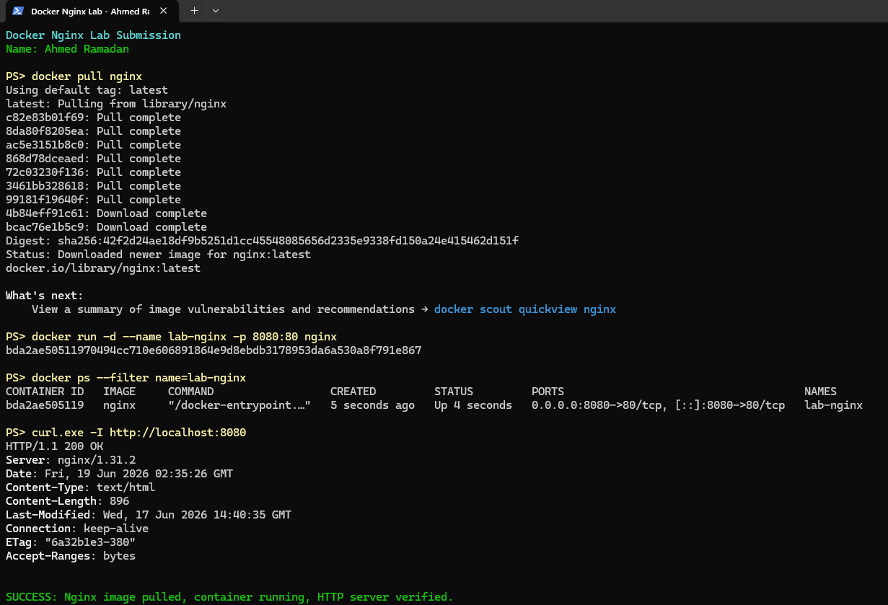

# Docker Lab 1: Pull and Run an Nginx Container

## Basic Information

| Field | Value |
| --- | --- |
| **Name** | Ahmed Ramadan |
| **Lab** | Docker Lab 1 |
| **Image** | `nginx:latest` |
| **Host port** | `8080` |
| **Container port** | `80` |

## Objective

Install Docker, pull a basic image from Docker Hub, run it as a container, and verify that the container is operating successfully.

## Procedure

### 1. Pull the Nginx image

The official Nginx image was downloaded from Docker Hub:

```powershell
docker pull nginx
```

Docker reported `Status: Downloaded newer image for nginx:latest`, confirming that the image and its layers were pulled successfully.

### 2. Run the container

The image was started as a detached container named `lab-nginx`. Port `8080` on the host was mapped to port `80` inside the container:

```powershell
docker run -d --name lab-nginx -p 8080:80 nginx
```

### 3. Confirm the container status

The running container was checked with:

```powershell
docker ps --filter name=lab-nginx
```

The output showed the container status as `Up` and confirmed the port mapping `0.0.0.0:8080->80/tcp`.

### 4. Verify the Nginx web server

An HTTP request was sent to the published local port:

```powershell
curl.exe -I http://localhost:8080
```

The server returned `HTTP/1.1 200 OK` with the `Server: nginx` header, proving that the container was running and serving web traffic correctly.

## Evidence

The screenshot below includes the student's name, image pull output, running-container status, and successful HTTP response.



## Result

The Docker installation was verified successfully. The official Nginx image was pulled from Docker Hub, started as a container, and reached through `http://localhost:8080` with an HTTP `200 OK` response.

## Useful Cleanup Commands

Stop and remove the lab container when it is no longer needed:

```powershell
docker stop lab-nginx
docker rm lab-nginx
```
