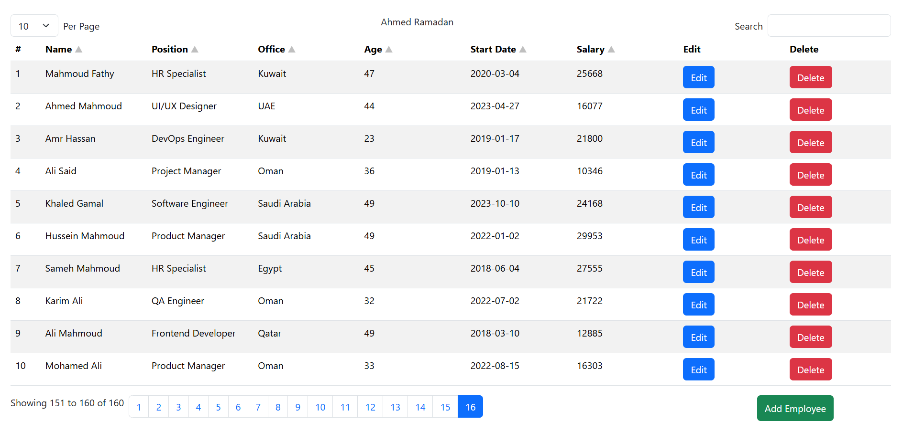

# Employee Data Table Manager

A lightweight, framework-free **Employee Management Web Application** built with **Vanilla JavaScript**, **HTML**, **CSS**, and **Bootstrap 5**.  
The project demonstrates clean DOM manipulation, RESTful API integration, and common data-table features used in real-world admin dashboards.

## 

[](https://drive.google.com/file/d/1ComCj-wOpUoOloirjiRhvHpUxpoo-2uO/view?usp=sharing)


## 🚀 Features

- **CRUD Operations**
    - Add, edit, and delete employees
    - Inline row editing with validation

- **Pagination**
    - Server-side pagination using `json-server`
    - Dynamic page navigation

- **Sorting**
    - Sort by name, position, office, age, start date, or salary
    - Toggle between ascending, descending, and inactive states

- **Search**
    - Global search across employee records

- **Configurable Page Size**
    - Display 10 / 25 / 50 / 100 rows per page

- **Clean UI**
    - Responsive table using Bootstrap 5
    - User-friendly layout suitable for admin dashboards

---

## 🧱 Tech Stack

- **Frontend**: HTML5, CSS3, Vanilla JavaScript
- **UI Framework**: Bootstrap 5
- **Backend (Mock API)**: `json-server`
- **Data Format**: JSON (REST-style endpoints)

---

## 📂 Project Structure

```text
├── index.html      # Main HTML layout
├── style.css       # Custom styles
├── index.js        # Application logic (CRUD, pagination, sorting)
├── db.json         # Mock database for json-server
└── README.md       # Project documentation
```

---

## ⚙️ Getting Started

### 1️⃣ Install Dependencies

```bash
npm install -g json-server
```

### 2️⃣ Run Mock Backend

```bash
json-server --watch db.json --port 3000
```

### 3️⃣ Open the App

Open `index.html` directly in your browser.

---

## 🌐 API Endpoints

| Method | Endpoint         | Description                                   |
| ------ | ---------------- | --------------------------------------------- |
| GET    | `/employees`     | Fetch employees (pagination, sorting, search) |
| POST   | `/employees`     | Add new employee                              |
| PUT    | `/employees/:id` | Update employee                               |
| DELETE | `/employees/:id` | Delete employee                               |

---

## 🧠 What This Project Demonstrates

- Strong understanding of **DOM manipulation** without frameworks
- Practical use of **REST APIs** and HTTP methods
- State handling for pagination, sorting, and filtering
- Writing maintainable, readable JavaScript code
- Real-world admin table behavior often used in enterprise systems

---

## 📌 Use Cases

- Admin dashboards
- HR management systems
- Learning reference for JavaScript CRUD applications
- Technical portfolio project

---

## 👤 Author

**Ahmed Ramadan**  
Full stack Web Developer

---
