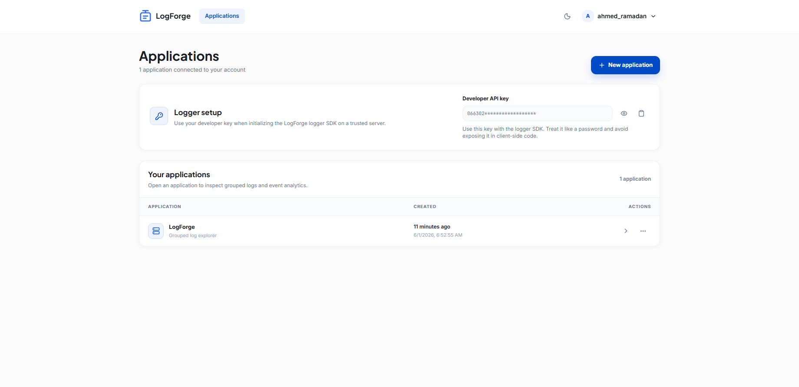
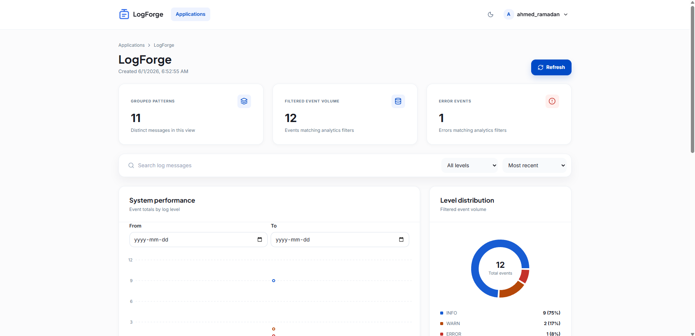
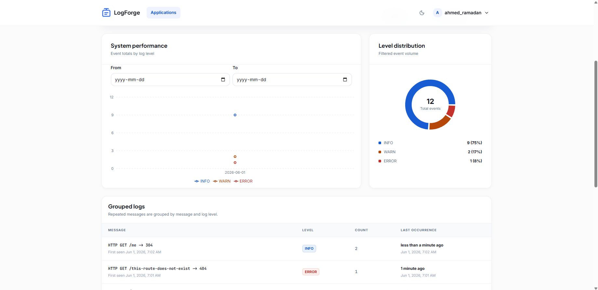
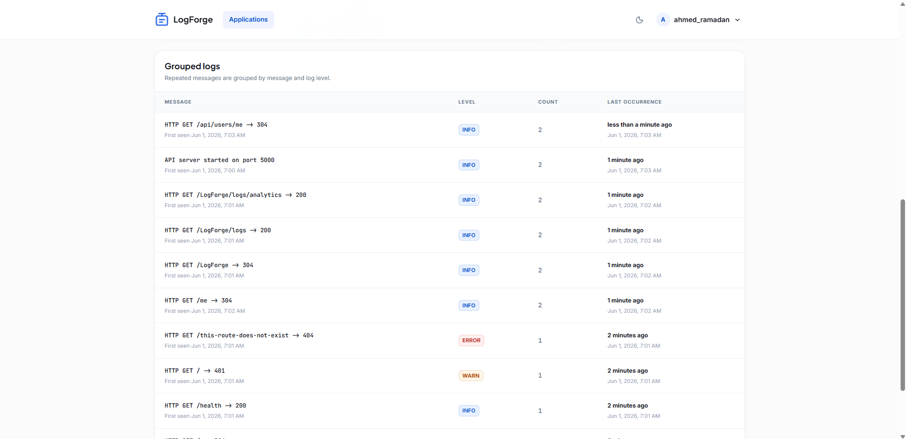

# LogForge

LogForge is a full-stack logging and observability platform for application developers. It lets developers register, create applications, ingest runtime logs through an API-key-protected server SDK, group repeated log messages, and inspect application activity through a React dashboard.

The repository is organized as a JavaScript monorepo with an Express/Mongoose API, a React dashboard, shared validation helpers, and a standalone publishable logger SDK.

# Screenshots

## Applications Page



---

## Dashboard Overview



---

## Analytics



---

## Logs Table



---

## Features

- Developer authentication with register, login, logout, and session restore.
- HTTP-only cookie sessions backed by JWT.
- Unique developer API keys for server-side log ingestion.
- Owner-scoped application management.
- Globally unique application names with whitespace validation.
- API-key-protected log ingestion.
- Ownership enforcement between API key and application.
- Grouped logs by application, message, and level.
- Incrementing log counts with first and last occurrence timestamps.
- Log browsing with pagination, sorting, level filtering, and message search.
- Analytics endpoint for level ratios and daily activity.
- React dashboard for account, application, logs, and analytics workflows.
- Standalone `logforge-logger-sdk` package for server applications.
- API self-logging through the logger SDK for real LogForge usage data.
- Production guards for required environment variables.
- Security middleware including Helmet, CORS, rate limiting, and request size limits.

## Repository Structure

```text
.
├── apps
│   ├── api                 # Express + Mongoose backend
│   └── dashboard           # React + Vite dashboard
├── packages
│   ├── logger-sdk          # Standalone LogForge server SDK
│   └── shared              # Shared constants and validation helpers
├── LogForge Requirements.md
├── package.json
└── README.md
```

## Technology Stack

| Area       | Stack                                     |
| ---------- | ----------------------------------------- |
| Backend    | Node.js, Express, Mongoose, MongoDB       |
| Auth       | JWT, HTTP-only cookies, bcrypt            |
| Dashboard  | React, Vite, React Router, TanStack Query |
| Charts     | Recharts                                  |
| SDK        | CommonJS package using built-in `fetch`   |
| Validation | Zod and shared validation helpers         |
| Tooling    | npm workspaces, ESLint, Vitest            |

## Requirements

- Node.js `20.19+` or `22.12+`
- npm `10+`
- MongoDB running locally or a MongoDB connection string

The SDK itself supports Node.js `18+` because it only requires built-in `fetch`.

## Quick Start

Install dependencies:

```bash
npm install
```

Create local environment files:

```bash
cp apps/api/.env.example apps/api/.env
cp apps/dashboard/.env.example apps/dashboard/.env
```

Start the API and dashboard:

```bash
npm run dev
```

Default local URLs:

- API: `http://localhost:5000`
- Dashboard: `http://localhost:5173`

## Environment Variables

### API

File: `apps/api/.env`

```env
MONGO_URI=mongodb://127.0.0.1:27017/logforge
JWT_SECRET=change-me-in-production
JWT_EXPIRES_IN=7d
API_PORT=5000
NODE_ENV=development
DASHBOARD_ORIGIN=http://localhost:5173
COOKIE_NAME=logforge_token

LOGGER_ENABLED=true
LOGGER_APP_NAME=LogForge
LOGGER_API_KEY=991d0e74ad6ddbc7a46167c9b576d3fce424965cc7184838d330768957e8c33e
LOGGER_BASE_URL=http://127.0.0.1:5000
LOGGER_AUTO_PROVISION=true
LOGGER_MAX_RETRIES=0
LOGGER_TIMEOUT_MS=1500
```

Production requires explicit values for:

- `MONGO_URI`
- `JWT_SECRET`
- `DASHBOARD_ORIGIN`

If API self-logging is enabled in production, these are also required:

- `LOGGER_API_KEY`
- `LOGGER_APP_NAME`
- `LOGGER_BASE_URL`

### Dashboard

File: `apps/dashboard/.env`

```env
VITE_API_URL=http://localhost:5000
```

## API Self-Logging

The API uses `logforge-logger-sdk` internally so LogForge can observe its own backend traffic.

Behavior:

- Successful responses are logged as `INFO`.
- Client errors are logged as `WARN`.
- `404` responses and server errors are logged as `ERROR`.
- The log ingestion endpoint is excluded to prevent recursive logging loops.
- In development, `LOGGER_AUTO_PROVISION=true` can create the configured `LogForge` application when the configured API key belongs to an existing developer.

Example grouped rows created by the self-logger:

```text
INFO  HTTP GET /health -> 200
WARN  HTTP GET /api/applications -> 401
ERROR HTTP GET /invalid-link -> 404
```

## API Reference

All protected dashboard endpoints use the session cookie returned by login/register.

### Users

| Method | Endpoint              | Description                               |
| ------ | --------------------- | ----------------------------------------- |
| `POST` | `/api/users/register` | Create developer account and session      |
| `POST` | `/api/users/login`    | Authenticate developer and create session |
| `POST` | `/api/users/logout`   | Clear session cookie                      |
| `GET`  | `/api/users/me`       | Return current authenticated developer    |

### Applications

| Method   | Endpoint                  | Description                                  |
| -------- | ------------------------- | -------------------------------------------- |
| `GET`    | `/api/applications`       | List applications owned by current developer |
| `POST`   | `/api/applications`       | Create application                           |
| `GET`    | `/api/applications/:name` | Get owned application by name                |
| `DELETE` | `/api/applications/:name` | Delete owned application and its logs        |

Create application body:

```json
{
  "name": "shop-api"
}
```

Application names must be unique globally, contain no whitespace, and be at most 80 characters.

### Logs

| Method | Endpoint                                 | Description                          |
| ------ | ---------------------------------------- | ------------------------------------ |
| `GET`  | `/api/applications/:name/logs`           | List grouped logs                    |
| `POST` | `/api/applications/:name/logs`           | Ingest log using API key             |
| `GET`  | `/api/applications/:name/logs/analytics` | Return level totals and daily series |

List query params:

| Param    | Values                  | Default    |
| -------- | ----------------------- | ---------- |
| `page`   | Positive integer        | `1`        |
| `limit`  | `1` to `100`            | `10`       |
| `sortBy` | `recent`, `count`       | `recent`   |
| `level`  | `INFO`, `WARN`, `ERROR` | all levels |
| `search` | Message substring       | empty      |

Ingest headers:

```http
x-api-key: YOUR_DEVELOPER_API_KEY
```

Ingest body:

```json
{
  "message": "Payment failed",
  "level": "ERROR"
}
```

Analytics query params:

| Param    | Description             |
| -------- | ----------------------- |
| `from`   | Start datetime          |
| `to`     | End datetime            |
| `level`  | Optional level filter   |
| `search` | Optional message search |

## Logger SDK

Package: `logforge-logger-sdk`

Install after publishing:

```bash
npm install logforge-logger-sdk
```

Usage:

```js
const logger = require('logforge-logger-sdk');

logger.init({
  apiKey: 'YOUR_DEVELOPER_API_KEY',
  appName: 'shop-api',
  baseUrl: 'https://api.example.com',
  maxRetries: 2,
  timeoutMs: 5000,
  throwOnError: false,
});

await logger.log({
  message: 'Payment failed',
  level: 'ERROR',
});
```

Methods:

| Method                    | Description                                                        |
| ------------------------- | ------------------------------------------------------------------ |
| `init(options)`           | Stores API key, application name, API base URL, and retry behavior |
| `log({ message, level })` | Sends a log event to LogForge                                      |

Supported levels:

- `INFO`
- `WARN`
- `ERROR`

SDK constraints:

- `appName` is required, must contain no whitespace, and must be at most 80 characters.
- `message` is required and must be at most 500 characters.
- `baseUrl` must be an HTTP or HTTPS URL.

Publish the SDK:

```bash
npm publish -w logforge-logger-sdk
```

## Dashboard

The dashboard supports:

- Register, login, logout.
- API-key reveal and copy controls.
- Application list, create, and delete flows.
- Application details page.
- Grouped logs table with pagination.
- Sort by latest occurrence or highest count.
- Level and message filters.
- Analytics date controls.
- Level distribution pie chart.
- Daily INFO/WARN/ERROR line chart.
- Persisted light/dark theme.

## Scripts

Run from the repository root.

| Command                 | Description                      |
| ----------------------- | -------------------------------- |
| `npm run dev`           | Start API and dashboard together |
| `npm run dev:api`       | Start only the API               |
| `npm run dev:dashboard` | Start only the dashboard         |
| `npm run lint`          | Lint all workspaces              |
| `npm run test`          | Run all workspace tests          |
| `npm run build`         | Build all workspaces             |
| `npm run format`        | Format supported source files    |

Workspace-specific examples:

```bash
npm run lint -w @logforge/api
npm run build -w @logforge/dashboard
npm pack --dry-run -w logforge-logger-sdk
```

## Quality Checklist

Before submitting or deploying:

```bash
npm run lint -ws
npm run test -ws
npm run build -ws
npm audit --audit-level=moderate
npm pack --dry-run -w logforge-logger-sdk
```

## Production Notes

- Set a strong `JWT_SECRET`.
- Use a production MongoDB connection string.
- Set `DASHBOARD_ORIGIN` to the deployed dashboard URL.
- Use HTTPS in production.
- Use `secure` cookies by running with `NODE_ENV=production`.
- Configure `LOGGER_*` variables explicitly if API self-logging is enabled.
- Publish `logforge-logger-sdk` before referencing it outside the monorepo.
- Add repository and deployment URLs before final submission.

## Security Notes

- Passwords are hashed with bcrypt.
- Session tokens are stored in HTTP-only cookies.
- API key ingestion checks that the API key owner owns the target application.
- Application routes are session-protected.
- Ingestion routes are API-key-protected.
- Helmet is enabled.
- CORS is restricted by `DASHBOARD_ORIGIN`.
- Auth and ingestion rate limiters are enabled.
