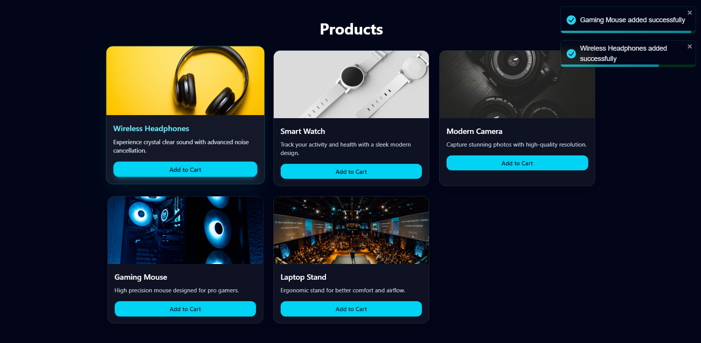

# React Product Cards UI

A modern and responsive product cards UI built with **React + Vite + Tailwind CSS**.  
Includes smooth hover effects and styled notifications using **React-Toastify**.

[](https://github.com/ahmed-ramadan-professional/ITI/tree/main/React/Lab-1)
[](https://ahmed-ramadan-professional.github.io/ITI/React/Lab-1/dist/index.html)



## Features

- ⚡ Built with React + Vite
- 🎨 Modern UI using Tailwind CSS
- 🧊 Glassmorphism design
- 🖱️ Smooth hover interactions
- 🔔 Styled notifications (React-Toastify)
- 📱 Fully responsive

---

## Tech Stack

- React
- Vite
- Tailwind CSS
- React Toastify

---

## Installation

```bash
git clone https://github.com/ahmed-ramadan-professional/ITI.git
cd ITI/React/Lab-1
npm install
npm run dev
```
