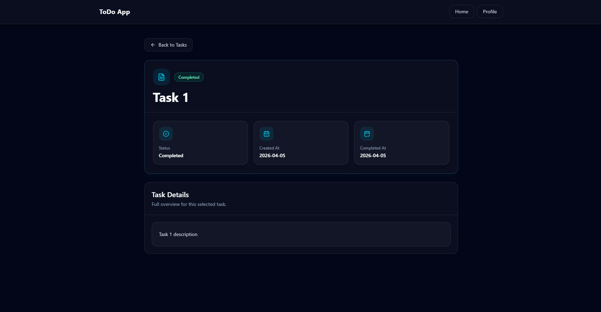
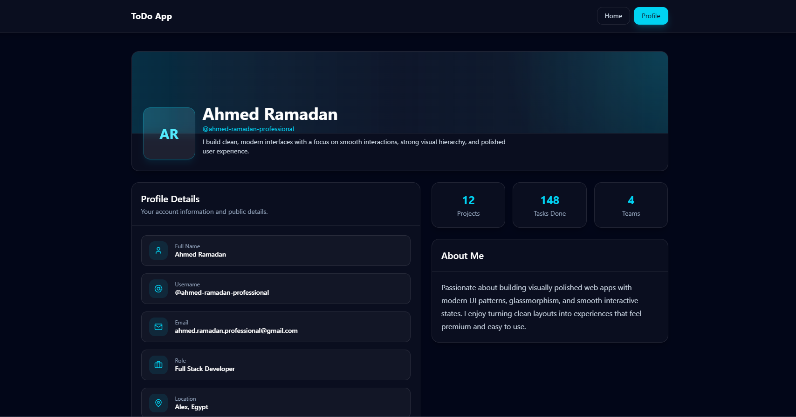

# React ToDo App

A modern and responsive task management app built with **React + Vite + Tailwind CSS**.  
Includes task creation, completion tracking, filtering, and detailed views with smooth hover effects and styled notifications using **React-Toastify**.

[](https://github.com/ahmed-ramadan-professional/ITI/React/Lab-2)
[](https://ahmed-ramadan-professional.github.io/ITI/React/Lab-2/dist/index.html)





## Features

- ⚡ Built with React + Vite
- 🎨 Modern UI using Tailwind CSS
- 🧊 Glassmorphism design
- ➕ Add and delete tasks
- ✅ Mark tasks as complete
- 🔍 Filter tasks (All/Completed)
- 📄 View detailed task information
- 👤 User profile page
- 🖱️ Smooth hover interactions
- 🔔 Styled notifications (React-Toastify)
- 📱 Fully responsive

---

## Tech Stack

- React
- Vite
- Tailwind CSS
- React Router
- Lucide React
- React Toastify

---

## Installation

```bash
git clone https://github.com/ahmed-ramadan-professional/ITI/React/Lab-2.git
cd ITI/React/Lab-2
npm install
npm run dev
```
