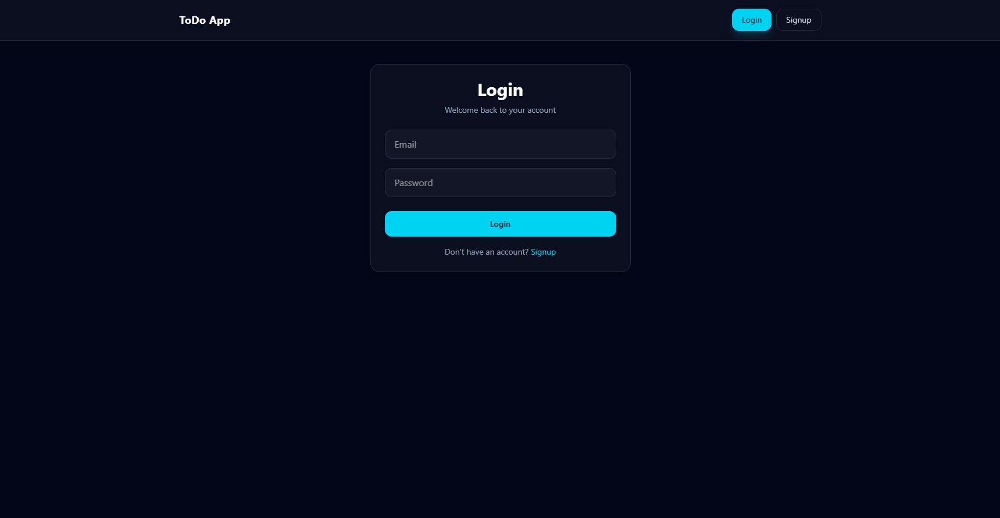
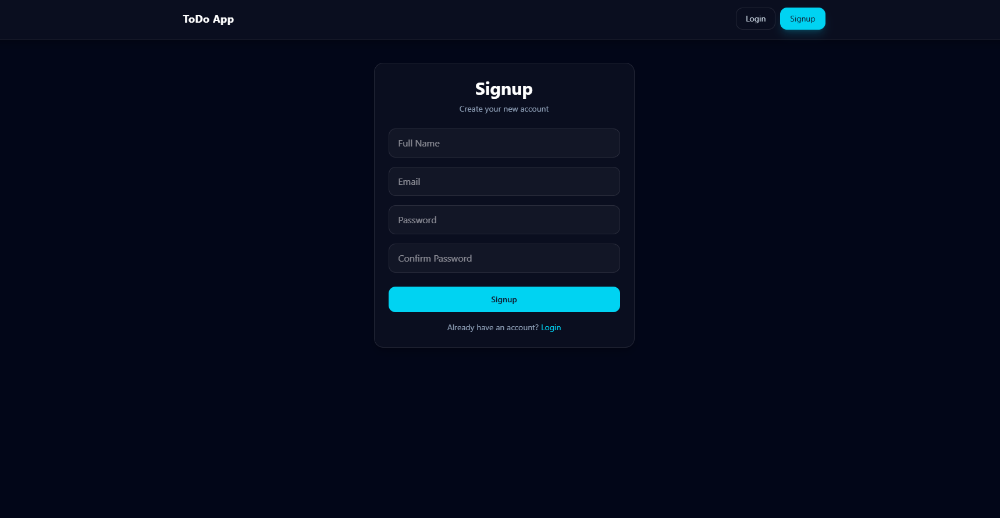
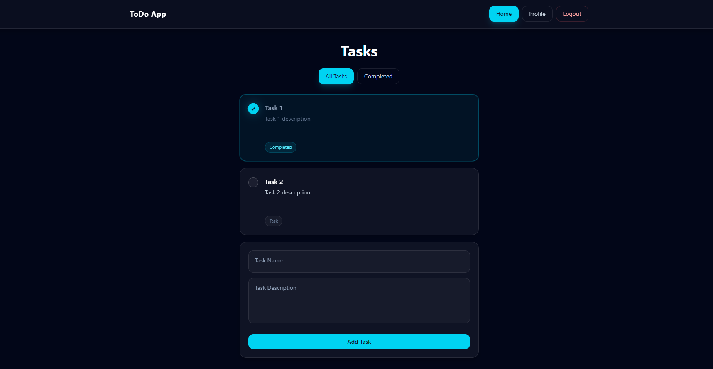
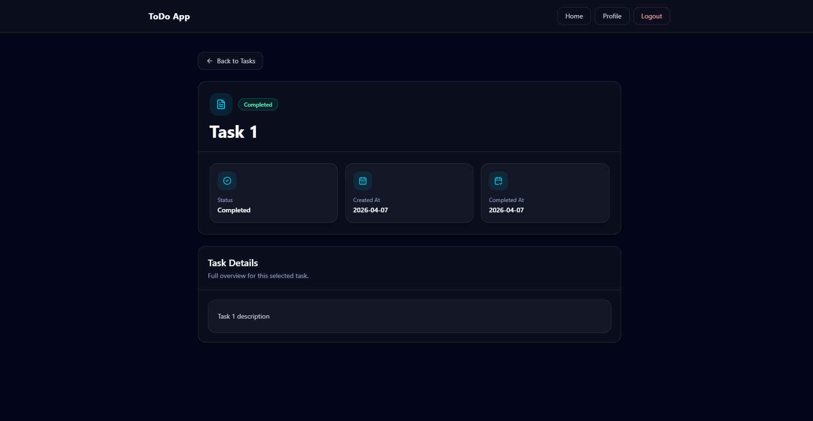
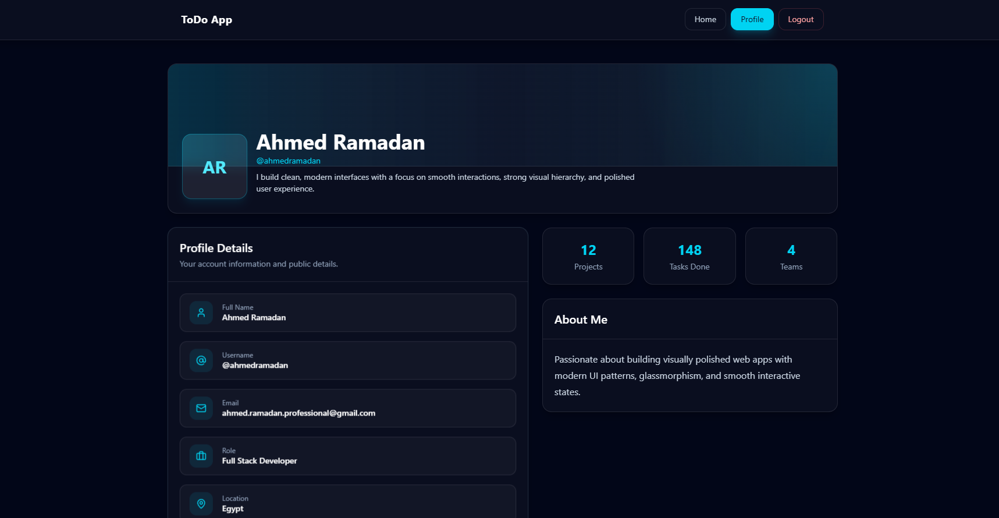
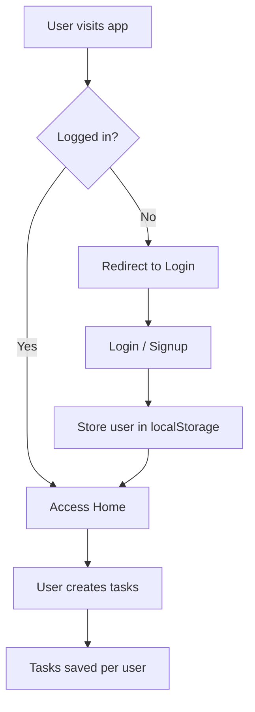

# React ToDo App

> A modern, fully-featured task management app with authentication, built using **React + Vite + Tailwind CSS**

<p >
  <a href="https://github.com/ahmed-ramadan-professional/ITI/tree/main/React/Lab-3">
    
  </a>
  <a href="https://ahmed-ramadan-professional.github.io/ITI/React/Lab-3/dist/">
    
  </a>
  
  
  
  
  
</p>

---

## Preview

<p>
  
  
  
  
  
</p>

---

## Features

### Authentication

- Login & Signup system
- Form validation with **Formik + Yup**
- Error handling with inline messages
- Redirect after login/signup
- Protected & guest routes
- Persistent sessions using `localStorage`

---

### Task Management

- Add / delete tasks
- Mark tasks as completed
- Filter tasks (All / Completed)
- View detailed task page
- Tasks are **user-specific** (isolated per account)

---

### UI & UX

- Modern UI with **Tailwind CSS**
- Glassmorphism design
- Smooth hover animations
- Responsive layout (mobile-first)
- Toast notifications via **React Toastify**

---

### Routing

- React Router v6
- Protected routes:
    - `/`
    - `/profile`
    - `/task/:id`

- Guest-only routes:
    - `/login`
    - `/signup`

- Custom **404 page**

---

## Tech Stack

| Category      | Tech           |
| ------------- | -------------- |
| Frontend      | React + Vite   |
| Styling       | Tailwind CSS   |
| Routing       | React Router   |
| Forms         | Formik         |
| Validation    | Yup            |
| Icons         | Lucide React   |
| Notifications | React Toastify |
| Storage       | localStorage   |

---

## Project Structure

```bash
src/
│
├── components/
│   ├── Navbar.jsx
│   ├── Card.jsx
│   ├── ProtectedRoute.jsx
│   └── GuestRoute.jsx
│
├── routes/
│   ├── Home.jsx
│   ├── Profile.jsx
│   ├── ViewTask.jsx
│   ├── Login.jsx
│   ├── Signup.jsx
│   └── NotFound.jsx
│
├── App.jsx
└── main.jsx
```

---

## Installation

```bash
git clone https://github.com/ahmed-ramadan-professional/ITI.git
cd ITI/React/Lab-3
npm install
npm run dev
```

---

## Authentication Flow



---

## How Tasks Are Stored

Each user has isolated data:

```js
tasks_user@email.com
```

---

## ⚠️ Disclaimer

> This project uses **localStorage-based authentication**.

✔️ Great for learning and demos
❌ Not secure for production

---

## Future Improvements

- 🔐 Real authentication (JWT)
- ☁️ Database (MongoDB / Firebase)
- ✏️ Edit tasks
- 🌓 Dark mode toggle
- 📊 Dashboard analytics
- 👥 Multi-user collaboration

---

## 👨‍💻 Author

**Ahmed Ramadan**
Full Stack Developer

---

## ⭐ Support

If you like this project:

- ⭐ Star the repo
- 🍴 Fork it
- 🧠 Learn from it
